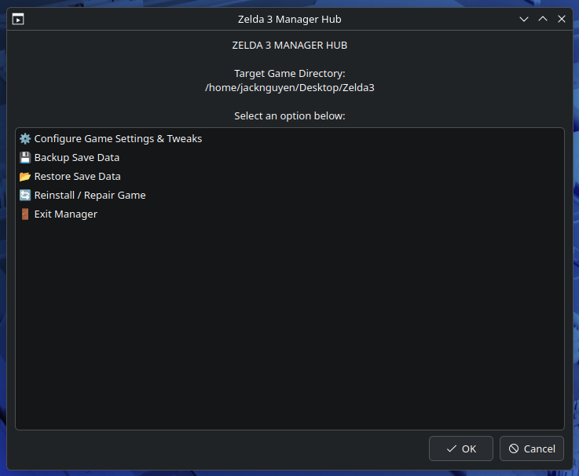
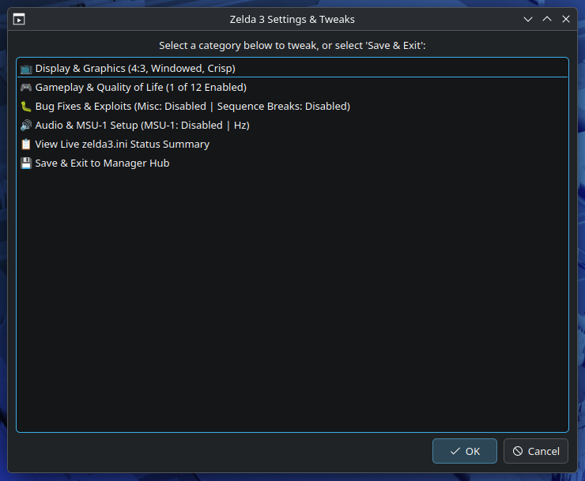
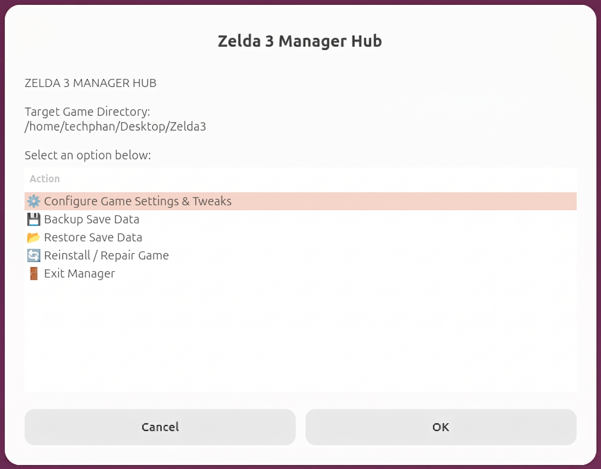
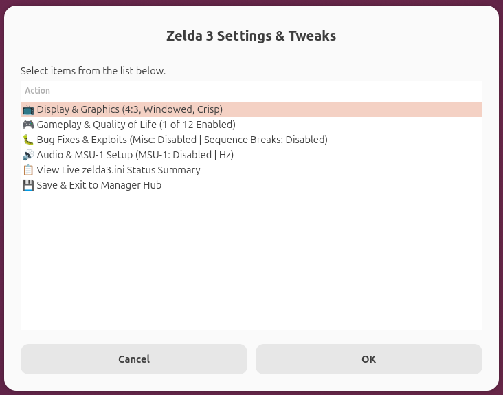
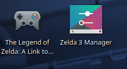

# Zelda 3 Linux & Steam Deck Manager

An all-in-one graphical installer, build toolchain, and interactive configuration manager for the [snesrev/zelda3](https://github.com/snesrev/zelda3) PC port of *The Legend of Zelda: A Link to the Past* on **Linux** and **Steam Deck (SteamOS)**.

> [!NOTE]
> **🤖 AI-Crafted Disclaimer:**
> This script was generated with the assistance of **Google Gemini AI**. While it was forged with great care (and plenty of digital fairies in bottles), please note that any unintended glitches, rogue Cuccos, or unexpected desktop hijinks are entirely unintentional. Use responsibly, back up your saves, and remember: *it's dangerous to go alone—take a terminal backup!* 🛡️🗡️

---

## ⚡ Quick Start & Usage

Open your terminal (or **Konsole** in Steam Deck Desktop Mode) and run:

```bash
# 1. Download the script
curl -sSL https://raw.githubusercontent.com/phanguy/Zelda-3-Linux-Installer-Manager/main/zelda3-manager.sh -o zelda3-manager.sh

# 2. Make it executable
chmod +x zelda3-manager.sh

# 3. Launch the manager
./zelda3-manager.sh
```

Or run it directly in one step without saving:
```bash
bash <(curl -sSL https://raw.githubusercontent.com/phanguy/Zelda-3-Linux-Installer-Manager/main/zelda3-manager.sh)
```

### Managing an Existing Installation
You can re-open the configuration hub anytime directly by double clicking the desktop shortcut or by commandline to tweak graphics, sound, or gameplay:
```bash
./zelda3-manager.sh --manage ~/zelda3
```

---

## 📸 Screenshots

### KDE Plasma (Steam Deck / KDialog)
<p align="center">
  
  
</p>

### GNOME / Others (Zenity)
<p align="center">
  
  
</p>

### Desktop Integration
<p align="center">
  
</p>

---

## 📋 Prerequisites & Requirements

- **Linux Operating System:**
  - **SteamOS / Steam Deck:** Supported out of the box in Desktop Mode (uses pre-installed `kdialog`).
  - **Ubuntu / Debian / Linux Mint / Pop!_OS:** Uses `zenity` (pre-installed, or `sudo apt install zenity`).
  - **Arch Linux / Fedora / Other:** Works with either `zenity` or `kdialog`.
- **A Legal ROM:**
  - A clean, unheadered **US 1.0 SNES ROM** (`.sfc`).
  - Expected SHA-256 Hash:  
    `66871d66be19ad2c34c927d6b14cd8eb6fc3181965b6e517cb361f7316009cfb`

---

## ✨ Features

- **Seamless GUI on Any Desktop:**
  - Automatically detects and uses **KDialog** (SteamOS / KDE Plasma) or **Zenity** (GNOME, Cinnamon, XFCE).
- **Automated Toolchain & Asset Extraction:**
  - Checks and validates required build dependencies (`gcc`, `g++`, `make`, `SDL2`, `libpng`, `git`, `python3`).
  - Native file dialog to select your ROM file.
  - Automatic SHA-256 hash verification, ROM asset extraction, and compilation of the native 64-bit binary.
- **Interactive Configuration & Tweaks Manager (`zelda3.ini`):**
  - **📺 Display & Graphics:**
    - Aspect Ratio: **16:10** (native Steam Deck fill without black bars), **16:9** (standard monitors/TVs), **4:3** (retro 1991 vanilla), or **18:9**.
    - Display Mode: Fullscreen / Windowed toggle.
    - Window Scale: 1x, 2x, 3x (1080p), or 4x (1440p/4K).
    - Pixel Filtering: Crisp (Nearest-neighbor) vs Smooth (Bilinear).
    - Dim Flashes: Photosensitivity safety guard.
  - **🎮 Gameplay & Quality of Life Tweaks:**
    - Live checklist of 12 enhancements including:
      - Quick Item Swap with L/R & Inventory Reordering (Y + D-Pad)
      - Turn corners while dashing with Pegasus Boots
      - Break ceramic pots with Master Sword
      - Collect hearts, rupees, and bombs with sword slashes
      - Mute the continuous low-health alarm beep
      - Cancel bird flute travel flight immediately with X button
      - Highlight maxed bombs, arrows, and rupees in yellow
      - Skip opening intro sequence with any key
      - Higher quality Mode 7 world map rendering
      - Optional balance tweaks: 4 active bombs, 9999 rupee wallet, Dark World mirror return.
    - **One-click presets:** `Select All`, `Deselect All` (Vanilla 1991 baseline), and `Recommended Defaults`.
  - **🐛 Bug Fixes & Exploits Guide:**
    - Individual toggles with in-depth explainers for:
      - **MiscBugFixes:** Engine and boss polish (Mothula spin immunity, glove palettes, discovery sound chimes, crash guards).
      - **GameChangingBugFixes:** Sequence breaks & classic speedrun glitches (wall clips, fake flippers, out-of-bounds).
  - **🔊 Audio & MSU-1 CD Audio Setup:**
    - Sample frequency (44,100 Hz / 48,000 Hz) and channel selection (Stereo / Mono).
    - Built-in installer for MSU-1 audio packs: point to any `.zip`, `.7z`, `.tar.gz` archive or folder of `.pcm` files for automatic extraction.
  - **🎮 Steam Deck Integration:**
    - Step-by-step guidance to add the compiled binary as a non-Steam game for full Game Mode support and cloud saves.

---

## 💡 Why I Made This

> *"I love A Link to the Past and was thrilled to play the native PC port on my Steam Deck and Linux PC. However, I found that actually getting it installed on my Steam Deck wasn't as straightforward as other decomp projects are. I've done a lot of messing around with AI(and at this point, who hasn't?) so I figured I could use it to help me install it. I was able to, but then realized there may be other people that want to be able to install it and do all the various tweaks as well! So here we are. I wanted a friendly, visual setup tool that handles everything from asset extraction to widescreen and QoL toggles with a few clicks. I hope it saves fellow adventurers some time!"*

---

## 📄 License & Credits

- The native Zelda 3 game engine port is developed by the [snesrev/zelda3](https://github.com/snesrev/zelda3) team.
- This manager utility is open-source and free to use and distribute.
